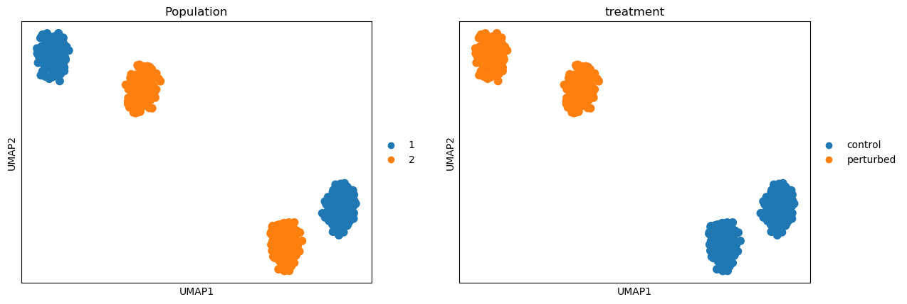
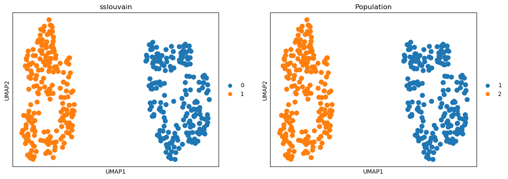

# icat
Identifying Cell-states Across Treatments

ICAT is a tool developed to better identify cell states in scRNAseq experiments where perturbations or some other biologic heterogeneity is present, such as gene knock-outs.

The method works by first identifying a set of conrol-defined cell states by performing unsupervised clustering. These identified cell states are then fed into a sparse gene weighting algorithm, Neighborhood Component Feature Selection (NCFS), to highly weight the most predictive genes, while also removing variance from non-explanatory genes. We then transform the data matrix using this weight vector, and perform semi-supervised clustering such that the originally identified control labels remain constant, but cells from experimental conditions

## Installation

ICAT can be installed on linux machines using `pip` with the following command:

`pip install icat-sc`

## Pre-print
To learn more about the algorithm, and how it compares to other methods, see our pre-print on [BioArxiv](https://www.biorxiv.org/content/10.1101/2022.05.26.493603v2)

## How to use

ICAT makes heavy use of the excellent `scanpy` library along with the associated `AnnData` data structure.

An example code block walks through running `icat` on a simulated dataset. The 
final clustering is stored in the `sslouvain` column of the returned `AnnData`
object.

```python
    from icat import simulate
    from icat import models
    import scanpy as sc
    import numpy as np
    data_model = simulate.SingleCellDataset(
        populations=2,
        genes=1000,
        dispersion=np.random.choice([1, 2, 3], 1000)
    )
    controls = data_model.simulate()
    controls.obs['treatment'] = 'control'
    perturbed = simulate.perturb(controls)
    perturbed.obs['treatment'] = 'perturbed'
    adata = controls.concatenate([perturbed])
    sc.pp.log1p(adata)
```
**visualizing dataset**

```python
    # specify model parameters -- see documentation for more information
    model = models.icat(
        ctrl_value="control",
        ncfs_kws={'reg': 1, 'sigma': 3},
        neighbor_kws={'n_neighbors': 15}, 
        cluster_kws={'resolution': 0.75},
    )
    # cluster cells by providing treatment information
    out = model.cluster(adata, adata.obs['treatment'])
    print(out.obs['sslouvain'].unique())
```
**visualizing results**


## Hyper Parameter Optimization
For working with your own data, we recommend finding appropriate Louvain and NCFS hyper
parameters **prior** to running the complete ICAT workflow. All hyper parameters used in the
original pre-print can be found as supplemental tables.
